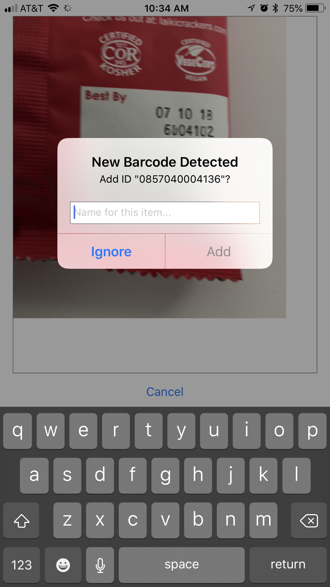
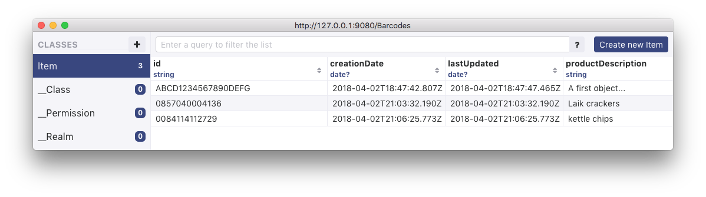

# RealmBarcode
### by David HM Spector <ds@realm.io>

## A Simple Barcode/QRCode Reader

<center> </center>

### Requirements
- [Xcode9.2](https://itunes.apple.com/us/app/xcode/id497799835?mt=12) or higher
- Swift 4.0 or higher
- [RealmSwift](https://realm.io/products/realm-database) version 3.0.0 higher
- [Cocoapods](https://www.cocoapods.org) version 1.4.x or higher
- [ROS](https://realm.io/products) version 3.0.0 or higher, installed via NPM
- [NPM and nodejs](https://www.npmjs.com/get-npm)
- [YARN](https://yarnpkg.com/en/) a faster nodejs dependency manager

<hr>

#### Bugs / ToDo

-[ ]  Get the `AVPreviewLayer` to correctly fill its enclosing view 
  
<hr>

### Server Description

As delivered this demo is designed to alow the user to utilize a ROS server on their local (build) machine. This is accomplished by determining the local machine's IP address at build time and storing the address in a file that is used to allow the client app to talk to the local server. Additionally,  this demo server uses the Realm `Nickname` auth mechanism  in order to remove the need to write login logic for this simple example.


### Client Description

The client is a simple `UITableView` based application that shows all known scanned objects and allows the user to scan new objects for insertion into a synchronized Realm database. The client operates on an extremely minimal data model  - just enough to capture the barcode, a description of the object and creation/modification dates:

```swift
class Item : Object {
    @objc dynamic var id = "" // this is the string scanned from the UPC or QRCode
    @objc dynamic var creationDate: Date?
    @objc dynamic var lastUpdated: Date?
    @objc dynamic var productDescription = ""
    
    // Initializers, accessors & cet.
    override static func primaryKey() -> String? {
        return "id"
    }
} 
```
These are stored in a Realm database - here shown viewed with Realm Studio:
<center> </center>


## Build Instructions

### Prerequisites
Before attempting to install the ROS server locally, install NPM and NodeJS - installation instructions can be found in the links above.

###  Building the Server

  1. Open  a new terminal window; change directory to the location where the repo has been downloaded.
  
  2. Change directory to the `barcode-server` directory; this contains a preconfigured version of the Realm Object Server
  
  3.  Invoke the `yarn` (or `npm install`) command to install all of the required packages
  
  4.  Once this process completes the server can be started with `npm run`  - this process will start the local Realm Object Server).
  
### Building the Client

  1. Open a new terminal window; change directory to the location where the repo has been downloaded

  2. Update the required Cocoapods by typing `pod update`
  
  3. Once this process completes, open the `RealmBarcode.xcworkspace` file with Xcode
  
  4.  if you are using a remote ROS server you will need to get the admin token from the same location on your remote server and well as replace the server IP variable in the constants file with the address of your remote ROS server.
  
  5. Connect an iPhone to the laptop, select it from the target device menu and press the `Build` button or press ⌘-R
  
  6. Once the app starts, tap the `+` button  in the navigation bar to start the scanner and point the camera at a barcode. 
  
  7. Once a barcode is scanned either a product detail page will be displayed (if the barcode is already in the Realm) or a New Item dialog allowing the user to enter a description is the item scanned is new allowing the user to insert the new item into the Realm.

